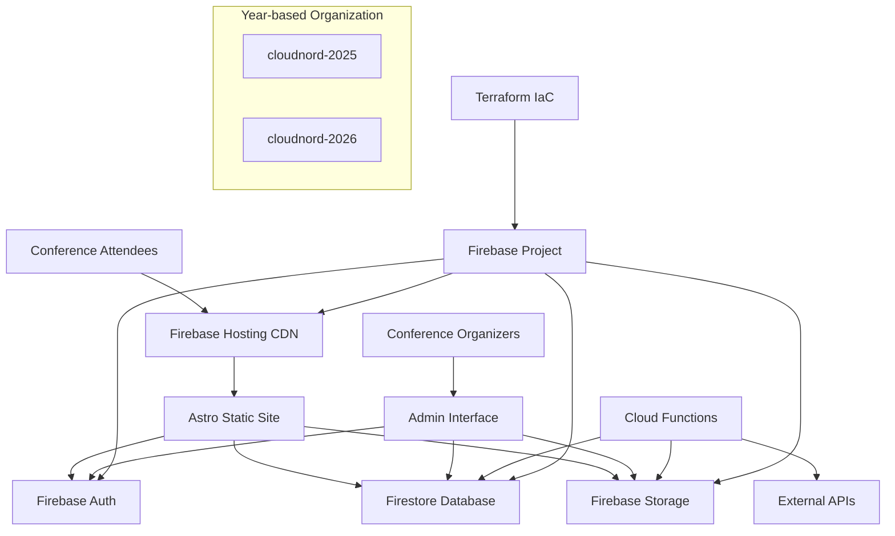

# Cloud Nord Fullstack Architecture Document

## Introduction

This document outlines the complete fullstack architecture for Cloud Nord, including backend systems, frontend implementation, and their integration. It serves as the single source of truth for AI-driven development, ensuring consistency across the entire technology stack.

This unified approach combines what would traditionally be separate backend and frontend architecture documents, streamlining the development process for modern fullstack applications where these concerns are increasingly intertwined.

### Starter Template or Existing Project

**Current Status:** Existing project based on Astro + Firebase stack

The Cloud Nord project is built on a sophisticated foundation:

-   **Frontend:** Astro-based static site generation with modern tooling
-   **Backend:** Firebase ecosystem (Hosting, Auth, Firestore, Storage, Analytics)
-   **Infrastructure:** Terraform-managed Firebase resources with year-based organization
-   **Deployment:** Firebase Hosting with custom domain (cloudnord.fr)
-   **Development Workflow:** Taskfile automation replacing traditional shell scripts

**Architectural Constraints:**

-   Must maintain year-based infrastructure organization (e.g., cloudnord-2025, cloudnord-2026)
-   Firebase project structure is manually created, Terraform manages resources within
-   Custom domain SSL certificate management is automated
-   SOPS encryption for secrets management is established
-   Multi-user team collaboration workflows are in place

**Modification Flexibility:**

-   Frontend framework can be enhanced or replaced while maintaining Firebase backend
-   Additional backend services can be integrated alongside Firebase
-   Infrastructure patterns are established and can be extended
-   Security practices and tooling are mature and should be retained

### Change Log

| Date       | Version | Description                             | Author              |
| ---------- | ------- | --------------------------------------- | ------------------- |
| 2025-01-06 | 1.0     | Initial fullstack architecture document | Winston (Architect) |

## High Level Architecture

### Technical Summary

Cloud Nord employs a modern Jamstack architecture with Firebase as the primary backend platform. The frontend uses Astro for static site generation with dynamic capabilities, while Firebase provides authentication, database, storage, and hosting services. The infrastructure follows a year-based organization pattern managed through Terraform, enabling isolated environments for each conference iteration. This architecture achieves rapid development cycles, excellent performance through CDN distribution, and enterprise-grade security through Firebase's managed services, directly supporting the PRD goals of delivering a scalable conference website platform.

### Platform and Infrastructure Choice

**Platform:** Google Cloud Platform via Firebase
**Key Services:** Firebase Hosting, Firestore, Authentication, Storage, Analytics, Cloud Functions
**Deployment Host and Regions:** Global CDN via Firebase Hosting with primary region in Europe

**Rationale:** Firebase provides a complete backend-as-a-service solution that eliminates infrastructure management overhead while providing enterprise-grade security, global CDN, and automatic scaling. The existing investment in Firebase ecosystem and proven year-based deployment pattern makes this the optimal choice for continued development.

### Repository Structure

**Structure:** Monorepo with clear separation of concerns
**Monorepo Tool:** Native npm workspaces (lightweight approach suitable for current scale)
**Package Organization:**

-   `/src` - Astro frontend application
-   `/functions` - Firebase Cloud Functions
-   `/terraform` - Infrastructure as Code
-   `/scripts` - Automation and deployment scripts
-   `/docs` - Documentation and architecture

The current structure effectively separates frontend, backend functions, and infrastructure concerns while maintaining simplicity appropriate for a conference website project.

### High Level Architecture Diagram



### Architectural Patterns

-   **Jamstack Architecture:** Static site generation with serverless functions for dynamic features - _Rationale:_ Optimal performance, security, and scalability for content-heavy conference websites
-   **Component-Based UI:** Astro components with TypeScript for type safety - _Rationale:_ Maintainability and reusability across conference pages and years
-   **Backend-as-a-Service (BaaS):** Firebase managed services for all backend needs - _Rationale:_ Reduces operational overhead and provides enterprise-grade security out of the box
-   **Infrastructure as Code:** Terraform for reproducible infrastructure deployment - _Rationale:_ Enables reliable year-based infrastructure provisioning and team collaboration
-   **Year-based Isolation:** Separate Firebase projects per conference year - _Rationale:_ Provides clean separation between conference iterations and enables independent scaling
-   **Secrets Management:** SOPS encryption with team collaboration - _Rationale:_ Secure secret sharing across team members while maintaining version control

## Tech Stack

### Technology Stack Table

| Category             | Technology                  | Version            | Purpose                                          | Rationale                                                                      |
| -------------------- | --------------------------- | ------------------ | ------------------------------------------------ | ------------------------------------------------------------------------------ |
| Frontend Language    | TypeScript                  | ^5.6.3             | Type-safe JavaScript development                 | Provides compile-time error checking and better IDE support for large codebase |
| Frontend Framework   | Astro                       | ^5.7.12            | Static site generation with islands architecture | Optimal performance for content-heavy sites with selective hydration           |
| UI Component Library | Tailwind CSS                | ^3.4.17            | Utility-first CSS framework                      | Rapid UI development with consistent design system                             |
| State Management     | Native Astro + Browser APIs | Latest             | Client-side state for interactive components     | Minimal overhead for conference website needs                                  |
| Backend Language     | TypeScript                  | ^5.6.3             | Cloud Functions development                      | Consistent language across frontend and backend                                |
| Backend Framework    | Firebase Functions          | ^11.6.0            | Serverless function execution                    | Seamless integration with Firebase ecosystem                                   |
| API Style            | REST + Firebase SDK         | Latest             | Direct Firebase integration                      | Leverages Firebase's optimized client libraries                                |
| Database             | Firestore                   | Latest             | NoSQL document database                          | Real-time capabilities and offline support for conference data                 |
| Cache                | Firebase Hosting CDN        | Latest             | Global content delivery                          | Built-in caching with Firebase Hosting                                         |
| File Storage         | Firebase Storage            | Latest             | Media and document storage                       | Integrated with Firebase security rules                                        |
| Authentication       | Firebase Auth               | Latest             | User authentication and authorization            | Comprehensive auth providers and security                                      |
| Frontend Testing     | Astro Testing               | Latest             | Component and integration testing                | Framework-native testing capabilities                                          |
| Backend Testing      | Firebase Emulator           | Latest             | Local function testing                           | Accurate local development environment                                         |
| E2E Testing          | Playwright                  | Latest             | End-to-end browser testing                       | Reliable cross-browser testing for conference workflows                        |
| Build Tool           | Astro CLI                   | ^5.7.12            | Frontend build and optimization                  | Integrated build system with Astro                                             |
| Bundler              | Vite                        | Latest (via Astro) | Fast development and production builds           | Modern bundling with hot module replacement                                    |
| IaC Tool             | Terraform                   | >=1.5              | Infrastructure provisioning                      | Declarative infrastructure management                                          |
| CI/CD                | GitHub Actions              | Latest             | Automated testing and deployment                 | Integrated with repository and Firebase                                        |
| Monitoring           | Firebase Analytics          | Latest             | User behavior and performance tracking           | Built-in analytics for conference insights                                     |
| Logging              | Firebase Functions Logs     | Latest             | Application logging and debugging                | Centralized logging with Firebase console                                      |
| CSS Framework        | Tailwind CSS + Typography   | ^3.4.17 + ^0.5.16  | Styling and content formatting                   | Utility-first approach with rich text support                                  |

## Data Models

The core data models represent the essential business entities for the Tech'Work conference platform. These models are designed to support the conference's unique value proposition of employer-sponsored professional development events.

### Event

**Purpose:** Central configuration for each annual conference iteration, supporting the year-based infrastructure organization.

**Key Attributes:**

-   name: string - Full event name (e.g., "Tech'Work Lyon 2026")
-   shortName: string - Abbreviated name for branding
-   year: string - Conference year for infrastructure isolation
-   date: EventDate - Complete date information including ISO format
-   location: EventLocation - Venue details with capacity and room information
-   theme: EventTheme - Main theme and sub-themes for content organization
-   statistics: EventStatistics - Expected metrics for planning
-   pricing: EventPricing - Pricing model (free for employees, employer-sponsored)

#### TypeScript Interface

```typescript
interface Event {
    name: string
    shortName: string
    tagline: string
    description: string
    year: string
    date: {
        full: string
        day: number
        month: string
        year: number
        dayOfWeek: string
        iso: string
    }
    location: {
        venue: string
        address: string
        city: string
        region: string
        country: string
        coordinates: { lat: number; lng: number }
        capacity: number
        rooms: Room[]
    }
    theme: {
        main: string
        subThemes: string[]
    }
    statistics: {
        expectedAttendees: number
        speakers: number
        talks: number
        workshops: number
        partners: number
    }
    pricing: {
        currency: string
        freeForEmployees: boolean
        sponsoredByEmployers: boolean
    }
}
```

#### Relationships

-   One Event has many Sessions
-   One Event has many Speakers
-   One Event has many Sponsors
-   One Event has many Team members
